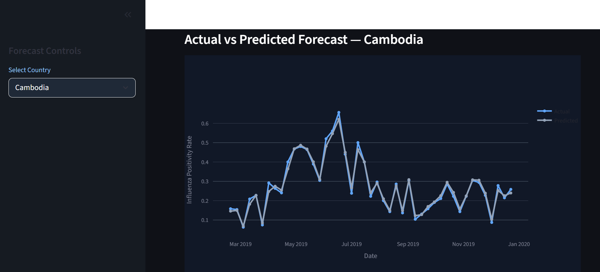
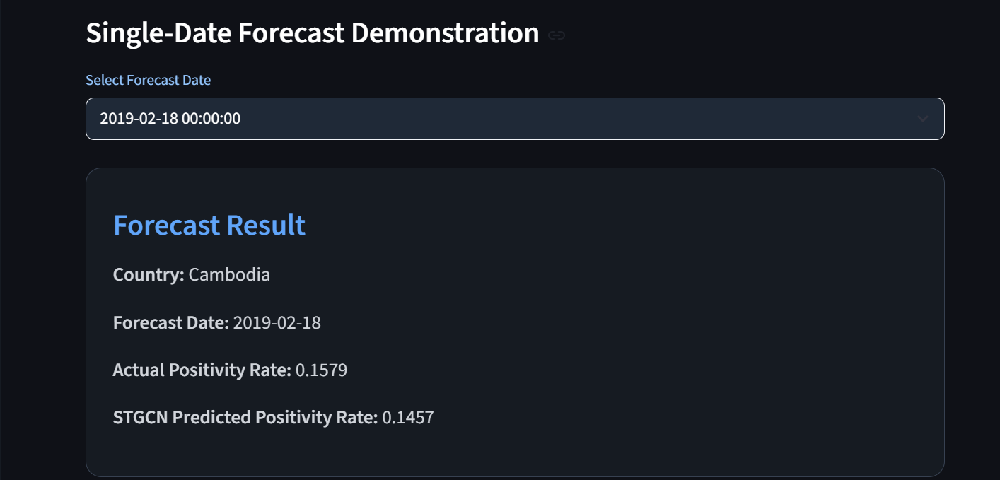
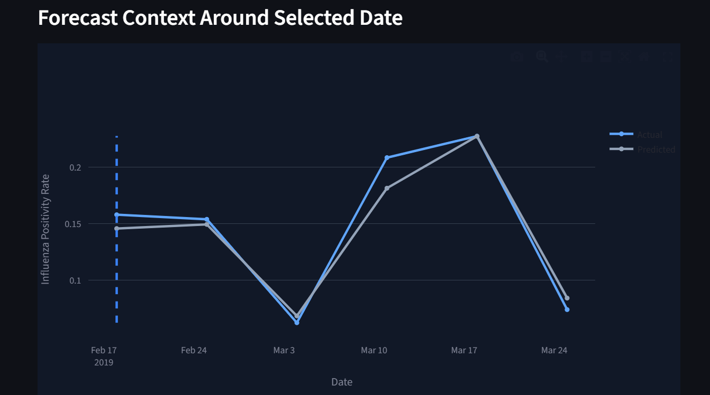
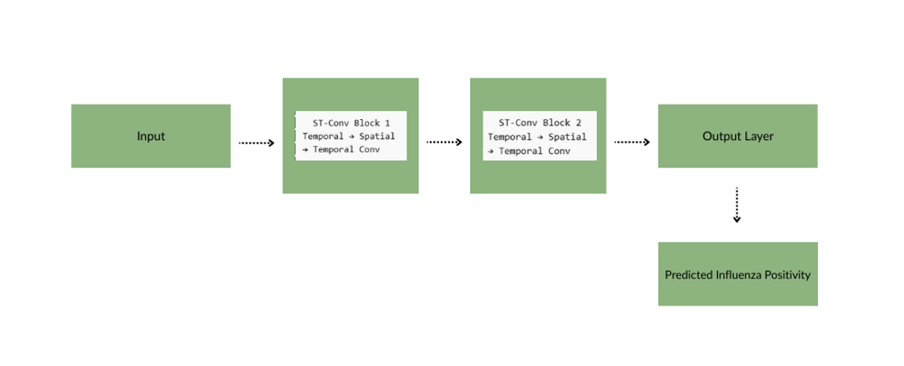

# Short-Term Influenza Forecasting in ASEAN Using Spatio-Temporal Graph Convolutional Networks (STGCN)

An end-to-end spatio-temporal deep learning framework for forecasting influenza activity across ASEAN countries using Graph Neural Networks and temporal convolutional architectures.

## Overview

Influenza remains a major public health concern across Southeast Asia due to seasonal variability, climatic influences, and cross-border transmission patterns. Accurate short-term forecasting can support public health planning, outbreak monitoring, and resource allocation.

This project proposes a **Spatio-Temporal Graph Convolutional Network (STGCN)** for influenza forecasting across eight ASEAN countries. Unlike traditional forecasting methods that model each country independently, the proposed framework simultaneously learns:

* Temporal influenza patterns
* Spatial relationships between countries
* Seasonal disease dynamics
* Regional transmission behavior

The model integrates epidemiological, climate, healthcare, demographic, and socioeconomic indicators collected between 2010 and 2019.

---

## Key Results

The proposed STGCN achieved the best performance among all evaluated forecasting models.

| Model         | Configuration   | R²         | RMSE       | MAE        |
| ------------- | --------------- | ---------- | ---------- | ---------- |
| **STGCN**     | Daily + Spatial | **0.9486** | **0.0313** | **0.0197** |
| XGBoost       | Daily           | 0.9243     | 0.0385     | 0.0213     |
| Random Forest | Daily           | 0.8217     | 0.0591     | 0.0278     |
| Ensemble      | Weekly          | 0.5990     | 0.0980     | 0.0753     |
| LightGBM      | Weekly          | 0.5850     | 0.0985     | 0.0763     |
| Random Forest | Weekly          | 0.5831     | 0.0988     | 0.0756     |
| XGBoost       | Weekly          | 0.5719     | 0.1001     | 0.0802     |
| ARIMA         | Weekly          | 0.5162     | 0.1159     | 0.1129     |
| SARIMA        | Weekly          | 0.4065     | 0.1284     | 0.1029     |

### Main Findings

* Daily-resolution forecasting significantly outperformed weekly forecasting approaches.
* Spatial modeling improved predictive performance compared to country-independent models.
* The STGCN achieved the highest R² and lowest forecasting error across all evaluated methods.
* Results demonstrate the effectiveness of spatio-temporal deep learning for infectious disease forecasting.

---

## Dashboard

An interactive web application was developed to demonstrate practical deployment of the forecasting framework.

### Actual vs Predicted Forecast

### Single-Date Forecast

### Forecast Context Analysis

The dashboard allows users to:

* Explore influenza forecasts by country
* Compare actual and predicted positivity rates
* Generate single-date forecasts
* Visualize forecast context around selected dates
* Monitor influenza activity across ASEAN countries

---

## Model Architecture

The proposed STGCN combines temporal convolution layers and graph convolution layers to jointly learn temporal disease dynamics and spatial interactions between countries.

Key components include:

* Temporal Convolution Layers
* Graph Convolution Layers
* Adaptive Trainable Adjacency Matrix
* Gated Linear Units (GLU)
* Huber Loss
* AdamW Optimizer
* Early Stopping

---

## Dataset

The framework integrates multiple data sources collected between 2010 and 2019.

### Epidemiological Features

* Influenza positivity rate
* Influenza positive cases
* Number of specimens tested

### Climate Features

* Temperature
* Relative humidity
* Absolute humidity

### Healthcare Features

* Hospital beds per 1,000 population
* Physicians per 1,000 population
* Life expectancy

### Socioeconomic Features

* GDP growth
* GDP per capita
* Population density
* Population age structure
* PM2.5 concentration

### Engineered Features

* Lag variables
* Rolling statistics
* Historical country averages
* Seasonal encodings

---

## Technologies

* Python
* PyTorch
* Scikit-Learn
* XGBoost
* LightGBM
* Statsmodels
* Pandas
* NumPy
* Plotly
* Streamlit
* NetworkX

---

## Future Work

* Dynamic graph learning
* Mobility-aware forecasting
* Transformer-based spatio-temporal models
* Explainable AI for epidemiological forecasting
* Real-time surveillance systems
* Multi-disease forecasting
